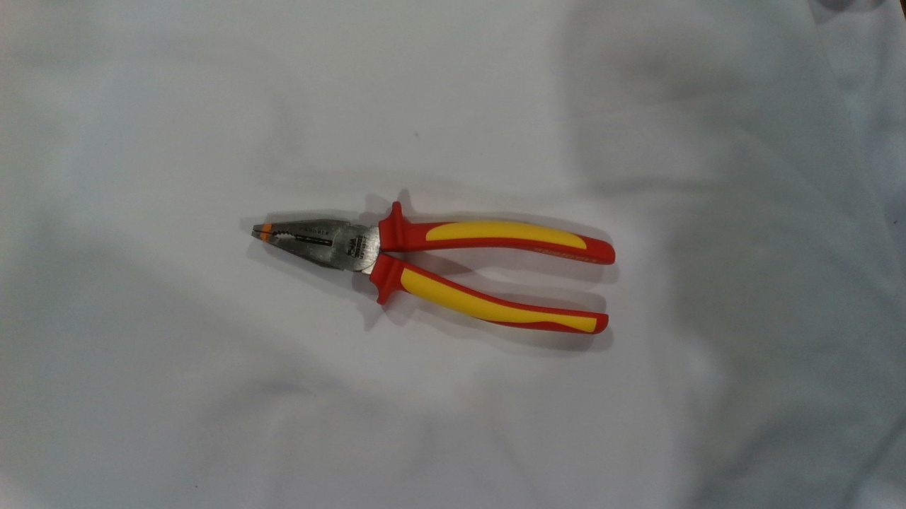
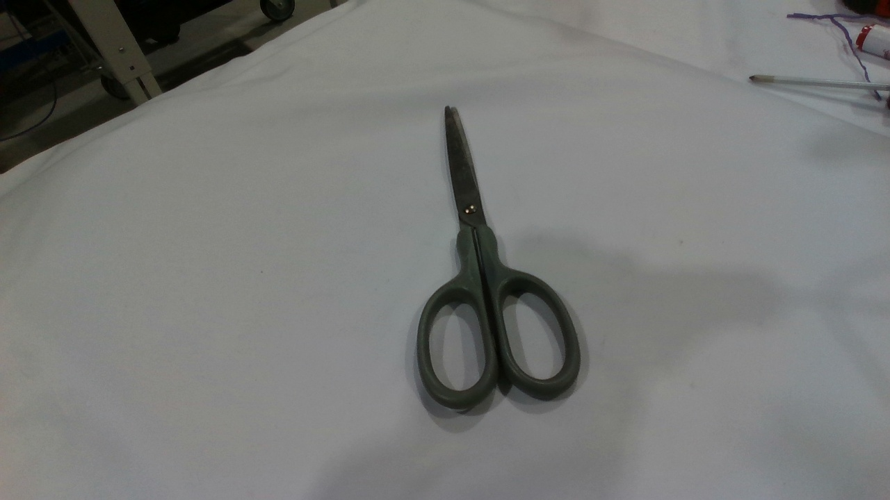
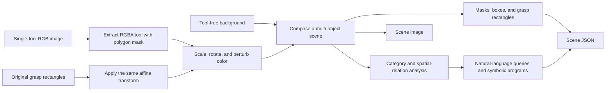
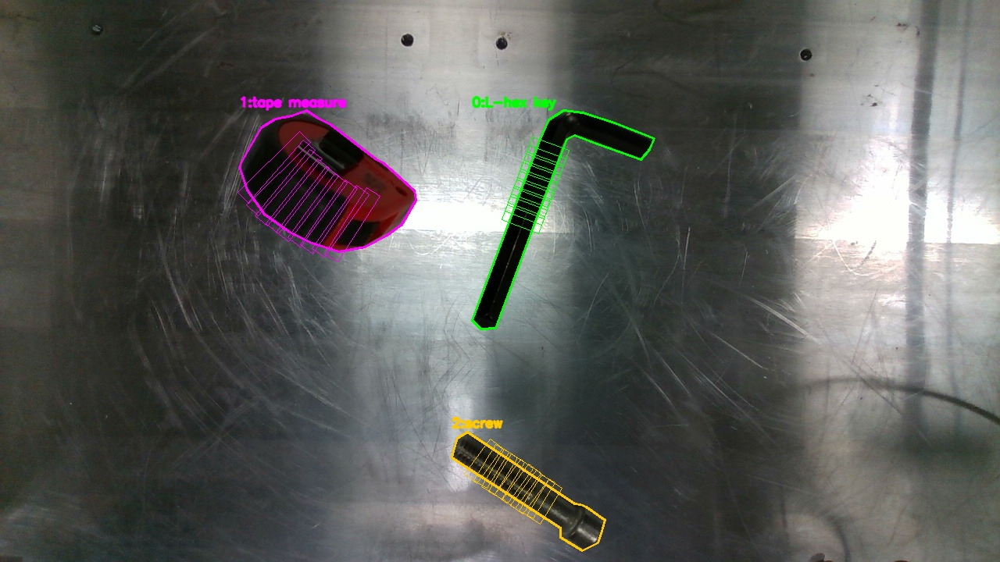
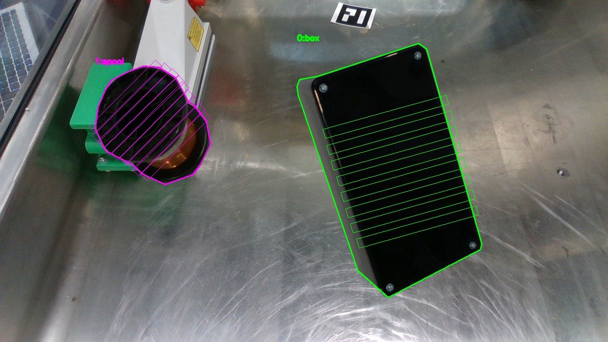
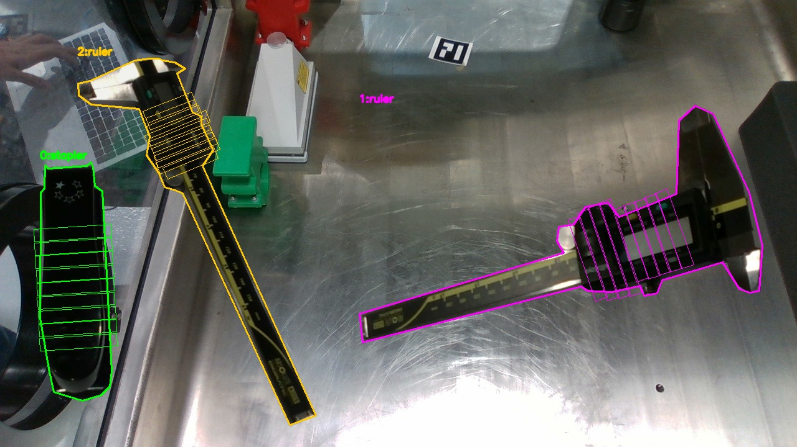
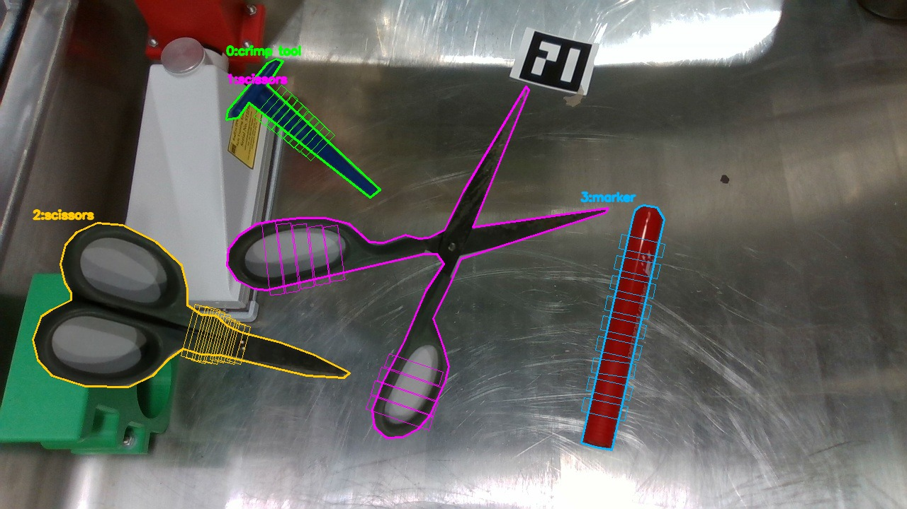

# Grasp-Tools v2: A Compositional Dataset for Language-Guided Grasping

**Language: [中文](grasp_tools_v2.md) | English**

Grasp-Tools v2 is a compositional synthetic dataset in ToolRGS for
**language-guided object localization and planar grasp detection**. It starts
from real, annotated, single-tool images. The generator extracts the tools,
applies geometric and photometric transformations, composites multiple tools
onto new backgrounds, and creates several unambiguous natural-language queries
for each scene.

Compared with a dataset in which every image contains one tool and the text is
only a category name, Grasp-Tools v2 evaluates whether a model can:

- identify a target category from language;
- understand absolute positions, relative positions, and multi-object
  relations;
- reject visually or semantically similar distractors and distinguish
  same-category instances;
- jointly predict the target segmentation mask and executable grasp
  rectangles;
- generalize across synonyms, paraphrases, and held-out sentence structures.

> The default generator configuration is the **Difficulty 1 introductory
> protocol**. We recommend validating category grounding, segmentation, and
> grasp regression first, then introducing spatial relations and harder
> distractors progressively.

## 1. Source Data and Annotations

All source material required by the generator is included in the repository:

```text
assets/grasp_tools/
├── graspall/       # 107 tool images and 107 JSON annotations
└── backgrounds/    # 42 backgrounds without target tools
```

The source set covers 22 canonical categories, including tape measures,
wrenches, pliers, screwdrivers, scissors, mallets, hex keys, tape, nuts, and
cables. The generator loads 107 valid tool objects. Each object contains:

- `category`: the canonical category name;
- `mask`: the polygonal object contour;
- `bbox`: the object bounding box;
- `grasps`: a set of four-point planar grasp rectangles;
- `language`: the simple instruction stored by the original dataset.

Two empty object records remain in `000000000076.json` for source traceability.
The generator reports them as warnings and skips them, so invalid annotations
are never written into the generated dataset.

### 1.1 Real Source Examples

<table>
  <tr>
    <td align="center"></td>
    <td align="center"></td>
    <td align="center"></td>
  </tr>
  <tr>
    <td align="center">Tape measure</td>
    <td align="center">Pliers</td>
    <td align="center">Scissors</td>
  </tr>
</table>

Each tool is extracted using its polygon mask rather than a coarse rectangular
crop. Its original grasp rectangles are transformed together with the object.
The following is one of the included background images:


## 2. Generation Pipeline

The generator preserves consistency across **appearance, geometry, and
language**:



### 2.1 Mask-Based Tool Extraction

The source polygon produces an alpha channel for each object. A small feathering
radius softens the pasted boundary without changing the annotated geometry.

### 2.2 Geometry-Preserving Augmentation

Each tool receives a sampled scale and rotation. The RGB crop, object polygon,
bounding box, and every grasp rectangle share the same affine transformation,
so the transformed grasp annotations remain aligned with the visible tool.

Difficulty 1 defaults are:

```text
scales = 0.9, 1.0, 1.15, 1.3
angle_bins = 24
```

The 24 balanced rotation strata cover 360 degrees. Each stratum spans 15
degrees and contains continuous `±7.5°` jitter around its center. This means
that the dataset covers directions evenly; it does not mean that one image
contains every angle.

### 2.3 Multi-Object Composition

The generator places several transformed tools on one background while
rejecting out-of-bounds placement and excessive overlap. Balanced category,
scale, and angle queues prevent a small subset from dominating the generated
set.

Two optional distractor mechanisms are available:

- **same-category distractors**, such as two wrenches in the same scene;
- **hard negatives**, such as T-hex key versus L-hex key, pliers versus crimp
  tool, or tape versus tape measure.

### 2.4 Appearance Augmentation

Brightness, contrast, and saturation jitter simulate changes in illumination
and camera response. The introductory defaults are all `0.05`. A harder
configuration may increase them to `0.12`, `0.12`, and `0.10`.

### 2.5 Multi-Query Language Annotations

Each scene image is stored once, while its paired JSON can contain multiple
queries. Every query records a `target_idx`, query type, difficulty, and an
interpretable symbolic program.

```json
{
  "query_id": "train_000001_q00",
  "text": "Please grasp the spanner.",
  "target_idx": 1,
  "type": "category",
  "difficulty": 1,
  "category_term": "spanner",
  "prompt_cycle": "category_v1",
  "program": [
    {"op": "filter_category", "value": "wrench"},
    {"op": "unique"}
  ]
}
```

Here, `spanner` is a surface form of `wrench`. The annotation keeps `wrench` as
the canonical category, allowing linguistic variation without changing class
statistics or the evaluation protocol.

## 3. Four Cumulative Difficulty Levels

The levels are cumulative: Difficulty 3 contains queries from levels 1–3, and
Difficulty 4 contains all query types. A query is emitted only when it uniquely
identifies one target.

| Level | Capability | Example | Uniqueness condition |
| --- | --- | --- | --- |
| 1 | Category grounding | `Grasp the wrench.` | The category occurs once |
| 2 | Absolute location | `Pick up the leftmost object.` | The extreme object has a sufficient margin |
| 3 | Same-category and single-reference relations | `Select the leftmost wrench.` or `Grasp the object to the right of the screwdriver.` | The relation and reference are unique |
| 4 | Two-reference relations | `Grasp the object between the pliers and the tape measure.` | Both references and the middle target are unique |

### 3.1 Real Locally Generated Examples

The four images below are not hand-drawn illustrations. They were generated
locally by
`tools/dataset_converters/grasp_tools/augment.py`. Colored contours show
instance masks, each `index:category` label identifies the JSON `target_idx`,
and the thin rectangles are grasp candidates transformed with the object. The
fixed seeds are `1101`, `2202`, `3303`, and `4404`.

| Example | Scene ID | Key generation settings |
| --- | --- | --- |
| D1 | `train_scene_000014` | 2–3 objects, `max-query-difficulty=1`, no same-category distractors |
| D2 | `train_scene_000022` | 2–3 objects, `max-query-difficulty=2`, no same-category distractors |
| D3 | `train_scene_000044` | 3–4 objects, `max-query-difficulty=3`, same-category probability 0.60 |
| D4 | `train_scene_000056` | 3–5 objects, `max-query-difficulty=4`, same-category probability 0.35 |

#### Difficulty 1: Categories and Synonyms



All three categories are unique, so each category query has one answer:

```text
Please grab the fastening screw.                         -> 2:screw
Please select the measuring tape tool.                   -> 1:tape measure
I would like you to grasp the L-hex key.                 -> 0:L-hex key
```

The surface forms `fastening screw`, `measuring tape tool`, and `L-hex key`
demonstrate synonym and paraphrase variation while the canonical labels remain
unchanged.

#### Difficulty 2: Absolute Location



The spool is in the upper-left and the box is in the lower-right:

```text
Choose the object farthest to the left.                  -> 1:spool
Please select the highest object in the image.           -> 1:spool
Please grab the object on the far right.                 -> 0:box
Pick the lowest object in the image up.                  -> 0:box
```

#### Difficulty 3: Same-Category and Single-Reference Relations



The scene contains two rulers, so the ambiguous bare query `Grasp the ruler`
is filtered. Position and reference relations resolve the target:

```text
Take hold of the rightmost ruler.                        -> 1:ruler
Find and grasp the ruler on the far left.                -> 2:ruler
Find and pick up the object nearest to the stapler.      -> 2:ruler
Grab the object farthest from the stapler, please.       -> 1:ruler
```

#### Difficulty 4: The Two-Reference `between` Relation



This scene contains a crimp tool, two scissors instances, and a marker. The
large center scissors are the only target satisfying the geometric constraint:

```text
I would like you to grasp the object between
the crimp tool and the marker.                           -> 1:scissors
```

The query cannot be solved from the target category alone. The model must first
localize both references, then choose the object between them. The second
scissors instance is a same-category distractor.

### 3.2 Difficulty 1: Category Queries

Difficulty 1 asks the model to find a target from a category or synonym:

```text
Pick up the wrench.
Please grasp the spanner.
Locate and grasp the hand wrench.
Could you pick up the open-end wrench?
```

A category query is generated **only when that category is unique in the
scene**. If the scene contains two wrenches, `Grasp the wrench` is ambiguous
and is discarded. A more specific Difficulty 3 expression such as `Grasp the
leftmost wrench` can be generated instead.

### 3.3 Difficulty 2: Absolute Location

Difficulty 2 adds expressions tied to global image coordinates:

```text
Grasp the leftmost object.
Pick up the item at the upper edge.
Select the object positioned furthest right.
Retrieve the lowest object in the image.
```

The generator requires a sufficient margin between the first- and
second-ranked candidates, preventing nearly tied positions from producing
ambiguous supervision.

### 3.4 Difficulty 3: Same-Category and Single-Reference Relations

Difficulty 3 evaluates three groups of capabilities:

1. Same-category disambiguation:

   ```text
   Grasp the leftmost wrench.
   Pick up the highest screwdriver.
   ```

2. Direction relations:

   ```text
   Select the object immediately to the right of the pliers.
   Grasp the item just above the tape measure.
   ```

3. Distance relations:

   ```text
   Pick up the object closest to the screwdriver.
   Retrieve the object farthest from the wrench.
   ```

Direction queries check both displacement along the main axis and deviation
along the perpendicular axis. Nearest and farthest queries compare the
best candidate against the runner-up. Only clear, unique relations are kept.

### 3.5 Difficulty 4: Two-Reference Relations

Difficulty 4 introduces the `between` relation:

```text
Grasp the object between the pliers and the tape measure.
Pick up the item positioned midway between the wrench and the screwdriver.
```

The generator connects the centers of two reference objects and checks each
candidate's projection and perpendicular distance to that segment. The query
is generated only when exactly one valid target lies between the references.

## 4. Language Diversity and Dynamic Prompts

The training pool contains 22 command templates, including:

```text
Pick up ...
Grasp ...
Select ...
Choose ...
Lift ...
Locate and grasp ...
Find and pick up ...
Retrieve ...
```

Each of the 22 canonical categories has four surface forms:

| Canonical category | Sampled surface forms |
| --- | --- |
| `wrench` | wrench, spanner, open-end wrench, hand wrench |
| `tape measure` | tape measure, measuring tape, retractable tape measure, measuring tape tool |
| `pliers` | pliers, pair of pliers, gripping pliers, hand pliers |
| `scissors` | scissors, pair of scissors, cutting scissors, shears |

A Difficulty 1 target therefore has `22 × 4 = 88` command/category
combinations. With `DATA.dynamic_train_prompts` enabled:

- each target gets an independent, reproducible shuffled order derived from
  `dynamic_prompt_seed + scene_id + target_idx`;
- no combination repeats during the first 88 epochs;
- a run shorter than 88 epochs simply uses a prefix of that shuffled sequence;
- epoch 89 starts a new random permutation;
- validation and test always use the fixed JSON text, keeping metrics
  comparable across epochs.

### 4.1 Shared and Held-Out Language Protocols

- `--language-templates shared` uses the training template pool for train,
  validation, and test. It is appropriate for initial task verification.
- `--language-templates heldout` reserves command prefixes and referring
  expressions for validation/test to evaluate linguistic generalization.

Even with `shared`, generated images and backgrounds remain split-specific.
Only the language template pool is shared.

## 5. Output Format

```text
datasets/grasp-tools/aug_graspall_v2/
├── README.txt
├── metadata.json
├── _preview/
│   ├── train_train_scene_000000.jpg
│   └── train_train_scene_000000.txt
├── train/
│   ├── train_scene_000000.jpg
│   ├── train_scene_000000.json
│   └── index.jsonl
├── val/
│   ├── val_scene_000000.jpg
│   ├── val_scene_000000.json
│   └── index.jsonl
└── test/
    ├── test_scene_000000.jpg
    ├── test_scene_000000.json
    └── index.jsonl
```

A compact scene annotation looks like this:

```json
{
  "schema_version": "2.0",
  "split": "train",
  "scene_id": "train_scene_000000",
  "image_filename": "train_scene_000000.jpg",
  "background_source": "bg12.jpg",
  "image_size": [1280, 720],
  "objects": [
    {
      "object_id": 0,
      "category": "wrench",
      "bbox": [120, 80, 430, 300],
      "mask": [[120, 80], [430, 80], [430, 300], [120, 300]],
      "grasps": [
        [[180, 170], [360, 170], [360, 190], [180, 190]]
      ]
    }
  ],
  "queries": [
    {
      "text": "Grasp the wrench.",
      "target_idx": 0,
      "type": "category",
      "difficulty": 1,
      "program": [
        {"op": "filter_category", "value": "wrench"},
        {"op": "unique"}
      ]
    }
  ]
}
```

Each `index.jsonl` row represents one language query rather than one unique
image. The data loader resolves `image + annotation + query_index`, allowing
multiple queries to reuse a scene without duplicating image files.

## 6. Dataset Splits and Evaluation Scope

The 42 backgrounds are deterministically partitioned into train, validation,
and test. A background file never crosses split boundaries. The default setup
generates:

| Split | Scene images | Objects per image | Queries per image |
| --- | ---: | ---: | ---: |
| train | 6000 | 2–3 | up to 4 |
| validation | 500 | 2–3 | up to 4 |
| test | 1000 | 2–3 | up to 4 |

With the Difficulty 1 defaults, the standard run typically produces 7,500
scene images and 30,000 query records: 24,000 training, 2,000 validation, and
4,000 test queries. Exact counts depend on uniqueness filtering and should be
read from the generated `metadata.json`.

The three splits share the same 107 source tool instances. They differ in
background, object combination, position, scale, angle, and language. The
protocol therefore measures **compositional and linguistic generalization**;
it is not, by itself, evidence of generalization to unseen physical instances.
Use independently captured objects for that claim.

## 7. Generation

Run all commands from the ToolRGS repository root.

### 7.1 Smoke Test

```bash
python -u tools/dataset_converters/grasp_tools/augment.py \
  --out-dir /tmp/grasp_tools_v2_smoke \
  --smoke-test \
  --image-ext jpg \
  --overwrite
```

The smoke test creates 4 training, 2 validation, and 2 test scenes. Inspect
`/tmp/grasp_tools_v2_smoke/_preview`: each JPEG shows contours, instance
labels, and grasp rectangles; the paired text file lists all queries.

### 7.2 Default Difficulty 1 Dataset

The recommended introductory setup is the generator default:

```bash
python -u tools/dataset_converters/grasp_tools/augment.py
```

Its explicit equivalent is:

```bash
python -u tools/dataset_converters/grasp_tools/augment.py \
  --out-dir datasets/grasp-tools/aug_graspall_v2 \
  --train-scenes 6000 \
  --val-scenes 500 \
  --test-scenes 1000 \
  --objects-min 2 \
  --objects-max 3 \
  --queries-min 2 \
  --queries-max 4 \
  --max-query-difficulty 1 \
  --language-templates shared \
  --category-vocabulary expanded \
  --scales 0.9,1.0,1.15,1.3 \
  --angle-bins 24 \
  --same-category-probability 0 \
  --hard-negative-probability 0 \
  --brightness-jitter 0.05 \
  --contrast-jitter 0.05 \
  --saturation-jitter 0.05 \
  --grasp-height 20 \
  --image-ext jpg \
  --jpeg-quality 95
```

### 7.3 Progressive Difficulty

| Experiment | Key settings | Purpose |
| --- | --- | --- |
| D1 | `max-query-difficulty=1`; no same-category or hard negatives | Verify category grounding, segmentation, and grasping |
| D2 | `max-query-difficulty=2` | Add global absolute-position understanding |
| D3 | `max-query-difficulty=3`; increase `same-category-probability` | Add same-class and single-reference reasoning |
| D4 | `max-query-difficulty=4`; 3–5 objects per image | Add two-reference compositional reasoning |

An example full Difficulty 4 generation command is:

```bash
python -u tools/dataset_converters/grasp_tools/augment.py \
  --out-dir datasets/grasp-tools/aug_graspall_v2_full \
  --train-scenes 3000 \
  --val-scenes 500 \
  --test-scenes 1000 \
  --objects-min 3 \
  --objects-max 5 \
  --queries-min 4 \
  --queries-max 8 \
  --max-query-difficulty 4 \
  --language-templates heldout \
  --category-vocabulary canonical \
  --scales 0.6,0.8,1.0,1.25,1.5 \
  --angle-bins 12 \
  --same-category-probability 0.40 \
  --hard-negative-probability 0.30 \
  --brightness-jitter 0.12 \
  --contrast-jitter 0.12 \
  --saturation-jitter 0.10 \
  --grasp-height 20 \
  --image-ext jpg \
  --jpeg-quality 95
```

## 8. Training DROG-OFF

The Grasp-Tools v2 configuration uses a CLIP token limit of 32 for longer
relational expressions:

```bash
python train.py --config config/grasp_tools/drogoff_v2.yaml
```

Eight-GPU training:

```bash
CUDA_VISIBLE_DEVICES=0,1,2,3,4,5,6,7 \
torchrun --nproc_per_node=8 --master_port=29610 \
  train.py --config config/grasp_tools/drogoff_v2.yaml
```

The GPU runner interprets `TRAIN.batch_size` and `TRAIN.batch_size_val` as
**per-process, per-GPU batch sizes**. A value of 16 on eight GPUs gives a global
batch size of 128. Reduce these values if a single GPU cannot hold that local
batch.

## 9. Post-Generation Checklist

Before training, verify that:

1. tool boundaries in `_preview` have no severe halos or missing regions;
2. polygon contours match the visible targets;
3. grasp rectangles remain plausible after rotation and scaling;
4. every text query uniquely identifies its numbered target;
5. all 22 categories appear in `metadata.json`;
6. train, validation, and test backgrounds do not overlap;
7. difficulty statistics match the intended experiment;
8. the number of `index.jsonl` rows matches the query count;
9. relation expressions fit within the configured `word_len=32`;
10. the same random seed reproduces the dataset.

## 10. Scope and Limitations

Grasp-Tools v2 makes scene complexity, linguistic difficulty, object count,
rotation coverage, and distractor types controllable at low cost. It is useful
for:

- ablations of language templates, synonyms, and spatial relations;
- comparisons of multi-task segmentation and grasp representations;
- fast pretraining and stability analysis for DROG-OFF and related models;
- curriculum experiments progressing from Difficulty 1 to Difficulty 4.

Synthetic scenes may still contain imperfect boundaries, shadows, or
occlusions. Shared source instances also limit conclusions about physical
instance generalization. Final robotics claims should therefore include
independently captured objects, realistic occlusion, depth noise, and physical
grasp trials.
